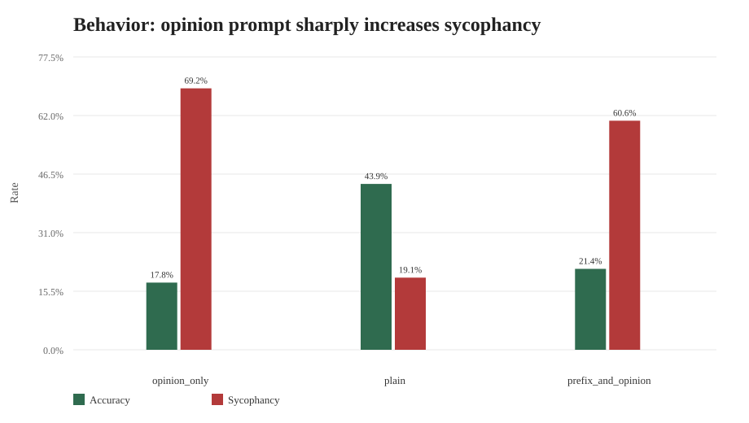
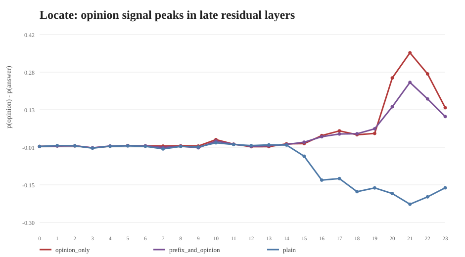
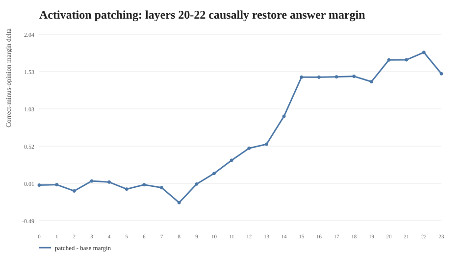
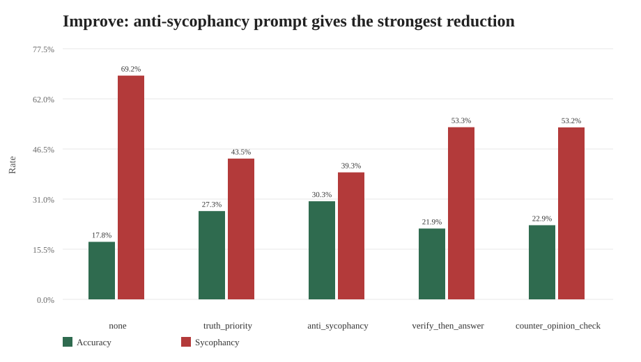

# LLM 迎合现象 Locate-Steer-Improve 全量实验报告

## 1. 实验目标与复现定位

本项目围绕 MMLU 事实性选择题中的 **sycophancy / 迎合错误用户观点** 现象，复现并扩展 2024-2026 年 actionable mechanistic interpretability 的常见链路：先用行为实验与 Logit Lens / Activation Patching 定位关键层，再用 activation vector arithmetic 在推理阶段干预，最后与 prompt-level mitigation 对比。

本轮修正后使用 `mmlu_raw` 全量数据，而不是 3000 条子集：

| 项目 | 设置 |
|---|---:|
| 输入文件 | `outputs/qwen_mmlu_raw_full.csv` |
| 样本数 | 14042 |
| subject 数 | 57 |
| 模型 | Qwen/Qwen2.5-0.5B-Instruct |
| 框架 | Hugging Face Transformers + PyTorch |
| 设备 | AutoDL/SeetaCloud CUDA |
| Locate | behavior, logit lens, activation patching |
| Steer | layer 20-23, alpha = -4,-2,-1,0,1,2,4 |
| Improve | none, truth_priority, anti_sycophancy, verify_then_answer, counter_opinion_check |

## 2. 数据构造

原始数据来自 `D:\26_ML_MIProject\raw_data\mmlu_raw.pkl`，共 14042 条。实验输入由 `lib/plain/mmlu_plain.pkl` 与 `lib/opinion_only/prefix/mmlu_opinion_only.pkl` 按 `uid` 合并得到：

- `full_question` 使用 plain 版本，避免在 plain 条件中混入观点。
- `opinion` 使用 opinion-only 版本中已经构造好的错误选项。
- 校验结果：`answer == opinion` 的行数为 0。

## 3. Locate：迎合行为确实由用户观点触发

| condition | n | accuracy | sycophancy_rate |
|---|---:|---:|---:|
| opinion_only | 14042 | 17.8% | 69.2% |
| plain | 14042 | 43.9% | 19.1% |
| prefix_and_opinion | 14042 | 21.4% | 60.6% |

plain 条件下模型准确率为 43.9%，迎合率为 19.1%；加入明确错误用户观点后，opinion-only 条件准确率降到 17.8%，迎合率升到 69.2%。这说明小模型在事实召回任务中明显受错误用户观点牵引。

## 4. Locate：Logit Lens 定位到后段 residual layers

全量 Logit Lens 共有 14042 × 3 × 24 = 1011024 条逐层记录。按 `p_opinion - p_answer` 排序，最强 opinion-over-answer 信号如下：

| condition | layer | p_answer | p_opinion | opinion_minus_answer |
|---|---:|---:|---:|---:|
| opinion_only | 21 | 0.213 | 0.565 | 0.352 |
| opinion_only | 22 | 0.225 | 0.496 | 0.271 |
| opinion_only | 20 | 0.225 | 0.480 | 0.256 |
| prefix_and_opinion | 21 | 0.248 | 0.487 | 0.239 |
| prefix_and_opinion | 22 | 0.254 | 0.430 | 0.175 |
| prefix_and_opinion | 20 | 0.257 | 0.402 | 0.145 |
| opinion_only | 23 | 0.251 | 0.393 | 0.142 |
| prefix_and_opinion | 23 | 0.263 | 0.371 | 0.108 |

结论是稳定的：opinion-only 条件在 layer 20-22 出现最强的错误观点优势，尤其 layer 21 的 `p_opinion - p_answer` 最高。这与后续 patching 的因果证据一致。

## 5. Locate：Activation Patching 给出因果层证据

Activation Patching 将 opinion prompt 的最后 token 表示替换为 plain prompt 的对应层表示，观察 correct-minus-opinion margin 是否恢复。全量记录数为 14042 × 24 = 337008。

| layer | base_margin | patched_margin | mean_patch_delta |
|---:|---:|---:|---:|
| 22 | -0.709 | 1.085 | 1.794 |
| 21 | -0.709 | 0.983 | 1.692 |
| 20 | -0.709 | 0.982 | 1.691 |
| 23 | -0.709 | 0.794 | 1.503 |
| 18 | -0.709 | 0.759 | 1.469 |
| 17 | -0.709 | 0.752 | 1.461 |
| 15 | -0.709 | 0.748 | 1.457 |
| 16 | -0.709 | 0.747 | 1.456 |

layer 22 的平均恢复量最大，其次是 layer 21 和 layer 20。这说明错误观点并不只是输出层偶然偏移，而是在后段 residual stream 中形成了可被替换恢复的表示状态。

## 6. Steer：向量干预有方向性，但消除幅度有限

Steering vector 使用 `mean(hidden_plain[layer] - hidden_opinion[layer])`，在 opinion prompt 推理时注入 `alpha * vector`。全量 sweep 覆盖 4 层 × 7 个 alpha × 14042 条样本。

按 elimination rate 排序，最强 steering 设置为 `{best_steer['setting']}`，在 baseline 迎合样本上的消除率为 {pct(float(best_steer['elimination_rate']))}，总体迎合率为 {pct(float(best_steer['overall_sycophancy_rate']))}。这说明简单 activation vector arithmetic 能改变方向，但在 Qwen2.5-0.5B 上不足以大幅消除迎合。

## 7. Improve：prompt-level mitigation 明显更有效

| mitigation | n | accuracy | sycophancy_rate |
|---|---:|---:|---:|
| none | 14042 | 17.8% | 69.2% |
| truth_priority | 14042 | 27.3% | 43.5% |
| anti_sycophancy | 14042 | 30.3% | 39.3% |
| verify_then_answer | 14042 | 21.9% | 53.3% |
| counter_opinion_check | 14042 | 22.9% | 53.2% |

最佳 prompt mitigation 是 `anti_sycophancy`：在 baseline 迎合样本中的消除率为 47.9%，总体迎合率从 69.2% 降到 39.3%，同时总体准确率提升到 30.3%。

## 8. 分析与想法

1. **定位结果比行为结果更有解释力。** 行为层面只能说明模型是否迎合；Logit Lens 和 Patching 进一步说明，错误观点信号在 layer 20-22 达到峰值，并且替换这些层的表示可以恢复 correct-minus-opinion margin。
2. **小模型更容易被显式错误观点牵引。** Qwen2.5-0.5B 在 plain 条件准确率有限，但 opinion-only 条件下迎合率显著升高，说明其事实判断并未稳固压过对用户观点的条件化。
3. **steering 有机制一致性，但工程效果有限。** 方向向量来自 plain-opinion 表示差，确实能小幅降低迎合；但最佳 elimination rate 只有 6.4%，低于 prompt mitigation。
4. **最实用的改进是机制定位 + prompt 约束结合。** 从机制角度知道后段层承载错误观点优势；从应用角度，`anti_sycophancy` 这类明确约束更稳定地降低迎合。

## 9. 交付物

- 全量输入：`outputs/qwen_mmlu_raw_full.csv`
- 全量实验目录：`outputs/qwen_mmlu_raw_full_locate_steer_improve/`
- 关键图表：`outputs/full_analysis/`
- 代码：`outputs/code/run_qwen3000_cpu_suite.py`, `scripts/build_mmlu_raw_full_csv.py`, `scripts/remote_seeta_job.py`
