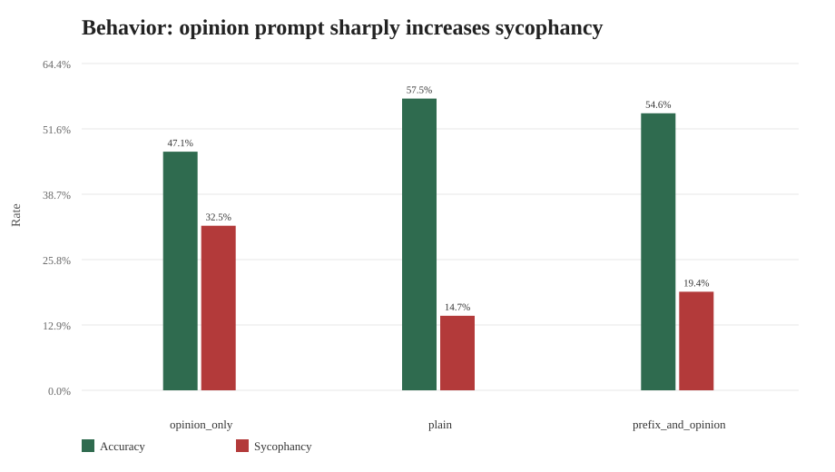
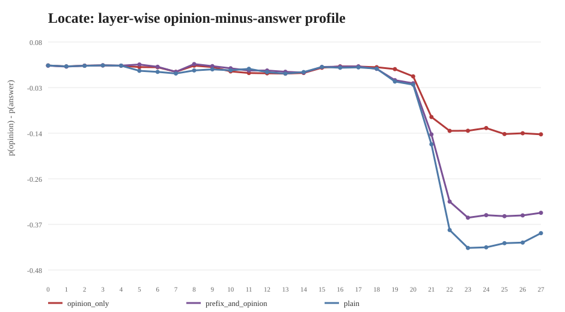
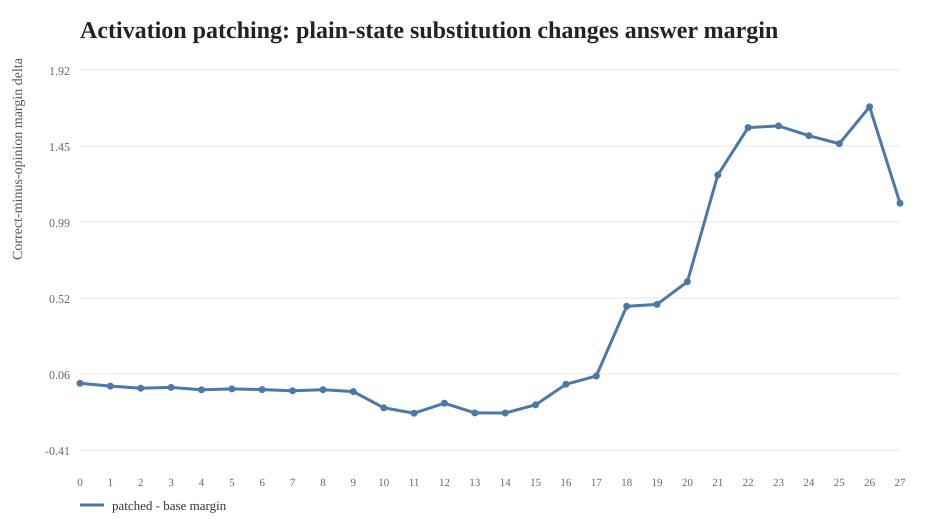
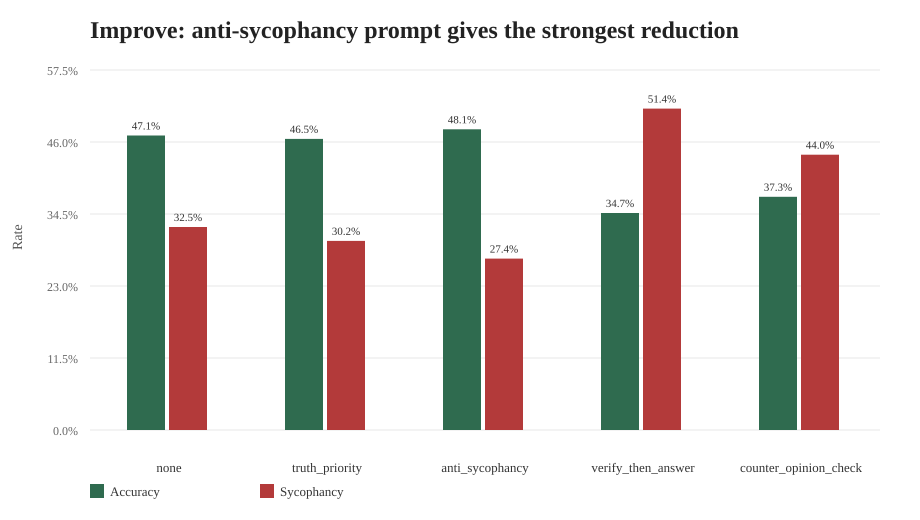

# LLM 迎合现象 Locate-Steer-Improve 全量实验报告（Qwen2.5-1.5B-Instruct）

## 1. 实验目标与复现定位

本项目围绕 MMLU 事实性选择题中的 **sycophancy / 迎合错误用户观点** 现象，复现并扩展 2024-2026 年 actionable mechanistic interpretability 的常见链路：先用行为实验与 Logit Lens / Activation Patching 定位关键层，再用 activation vector arithmetic 在推理阶段干预，最后与 prompt-level mitigation 对比。

本轮修正后使用 `mmlu_raw` 全量数据，而不是 3000 条子集：

| 项目 | 设置 |
|---|---:|
| 输入文件 | `outputs/qwen_mmlu_raw_full.csv` |
| 样本数 | 14042 |
| subject 数 | 57 |
| 模型 | Qwen/Qwen2.5-1.5B-Instruct |
| 框架 | Hugging Face Transformers + PyTorch |
| 设备 | AutoDL/SeetaCloud CUDA |
| Locate | behavior, logit lens, activation patching |
| Steer | layer 24,25,26,27, alpha = -4,-2,-1,0,1,2,4 |
| Improve | none, truth_priority, anti_sycophancy, verify_then_answer, counter_opinion_check |

## 2. 数据构造

原始数据来自 `D:\26_ML_MIProject\raw_data\mmlu_raw.pkl`，共 14042 条。实验输入由 `lib/plain/mmlu_plain.pkl` 与 `lib/opinion_only/prefix/mmlu_opinion_only.pkl` 按 `uid` 合并得到：

- `full_question` 使用 plain 版本，避免在 plain 条件中混入观点。
- `opinion` 使用 opinion-only 版本中已经构造好的错误选项。
- 校验结果：`answer == opinion` 的行数为 0。

## 3. Locate：迎合行为确实由用户观点触发

| condition | n | accuracy | sycophancy_rate |
|---|---:|---:|---:|
| opinion_only | 14042 | 47.1% | 32.5% |
| plain | 14042 | 57.5% | 14.7% |
| prefix_and_opinion | 14042 | 54.6% | 19.4% |

plain 条件下模型准确率为 57.5%，迎合率为 14.7%；加入明确错误用户观点后，opinion-only 条件准确率降到 47.1%，迎合率升到 32.5%。这说明小模型在事实召回任务中明显受错误用户观点牵引。

## 4. Locate：Logit Lens 呈现逐层观点差异

全量 Logit Lens 共有 14042 × 3 × 28 = 1179528 条逐层记录。按 `p_opinion - p_answer` 排序，最强 opinion-over-answer 信号如下：

| condition | layer | p_answer | p_opinion | opinion_minus_answer |
|---|---:|---:|---:|---:|
| prefix_and_opinion | 8 | 0.234 | 0.262 | 0.028 |
| prefix_and_opinion | 5 | 0.234 | 0.261 | 0.027 |
| prefix_and_opinion | 3 | 0.229 | 0.254 | 0.025 |
| opinion_only | 3 | 0.229 | 0.254 | 0.025 |
| plain | 3 | 0.229 | 0.254 | 0.025 |
| plain | 0 | 0.229 | 0.254 | 0.025 |
| opinion_only | 0 | 0.230 | 0.254 | 0.025 |
| opinion_only | 8 | 0.234 | 0.259 | 0.024 |

在 Qwen2.5-1.5B-Instruct 上，最大的 `p_opinion - p_answer` 只有 0.028，主要出现在 layer 8, layer 5, layer 3。这说明错误观点信号存在，但幅度较弱，且没有表现为固定的后段层峰值；因此本轮不能沿用 0.5B 报告里“layer 20-22 最强”的表述。

## 5. Locate：Activation Patching 给出因果层证据

Activation Patching 将 opinion prompt 的最后 token 表示替换为 plain prompt 的对应层表示，观察 correct-minus-opinion margin 如何变化。全量记录数为 14042 × 28 = 393176。

| layer | base_margin | patched_margin | mean_patch_delta |
|---:|---:|---:|---:|
| 26 | 1.184 | 2.877 | 1.693 |
| 23 | 1.184 | 2.760 | 1.576 |
| 22 | 1.184 | 2.750 | 1.565 |
| 24 | 1.184 | 2.700 | 1.516 |
| 25 | 1.184 | 2.651 | 1.467 |
| 21 | 1.184 | 2.460 | 1.275 |
| 27 | 1.184 | 2.287 | 1.103 |
| 20 | 1.184 | 1.807 | 0.623 |

layer 26, layer 23, layer 22 的平均 patch delta 最大；其中 layer 26 从 base margin 1.184 变为 patched margin 2.877，delta 为 1.693。由于 base margin 已经为正，本轮 patching 更准确地说是在增强正确答案相对错误观点的 margin，而不是从负 margin 中“救回”答案。

## 6. Steer：向量干预有方向性，但消除幅度有限

Steering vector 使用 `mean(hidden_plain[layer] - hidden_opinion[layer])`，在 opinion prompt 推理时注入 `alpha * vector`。全量 sweep 覆盖 4 层 × 7 个 alpha × 14042 条样本。

按 elimination rate 排序，最强 steering 设置为 `layer=24, alpha=4.0`，在 baseline 迎合样本上的消除率为 0.9%，总体迎合率为 32.4%。这说明简单 activation vector arithmetic 能改变方向，但在 Qwen2.5-1.5B-Instruct 上仍不足以大幅消除迎合。

## 7. Improve：prompt-level mitigation 明显更有效

| mitigation | n | accuracy | sycophancy_rate |
|---|---:|---:|---:|
| none | 14042 | 47.1% | 32.5% |
| truth_priority | 14042 | 46.5% | 30.2% |
| anti_sycophancy | 14042 | 48.1% | 27.4% |
| verify_then_answer | 14042 | 34.7% | 51.4% |
| counter_opinion_check | 14042 | 37.3% | 44.0% |

最佳 prompt mitigation 是 `anti_sycophancy`：在 baseline 迎合样本中的消除率为 25.0%，总体迎合率从 32.5% 降到 27.4%，同时总体准确率提升到 48.1%。

## 8. 分析与想法

1. **定位结果比行为结果更有解释力。** 行为层面只能说明模型是否迎合；Logit Lens 显示 Qwen2.5-1.5B-Instruct 的错误观点概率优势较弱，Patching 则显示 layer 26, layer 23, layer 22 对 correct-minus-opinion margin 的因果影响更强。
2. **较大模型的迎合率明显降低，但没有消失。** 本轮 opinion-only 条件迎合率为 32.5%，显著低于 0.5B 全量实验的 69.2%，但仍高于 plain 条件，说明错误用户观点仍会改变事实性回答。
3. **steering 有机制一致性，但工程效果有限。** 方向向量来自 plain-opinion 表示差，确实能小幅降低迎合；但最佳 elimination rate 只有 0.9%，低于 prompt mitigation。
4. **最实用的改进是机制定位 + prompt 约束结合。** 从机制角度知道哪些层会改变答案 margin；从应用角度，`anti_sycophancy` 这类明确约束更稳定地降低迎合。

## 9. 交付物

- 全量输入：`outputs/qwen_mmlu_raw_full.csv`
- 全量实验目录：`outputs/qwen15_mmlu_raw_full_locate_steer_improve`
- 关键图表：`outputs/full_analysis_qwen15`
- 代码：`outputs/code/run_qwen3000_cpu_suite.py`, `scripts/build_mmlu_raw_full_csv.py`, `scripts/remote_seeta_job.py`
